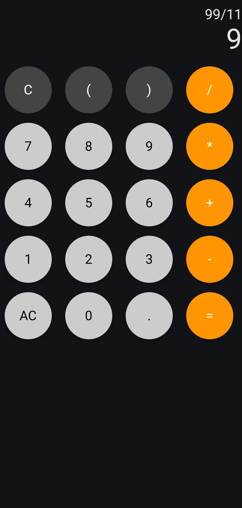
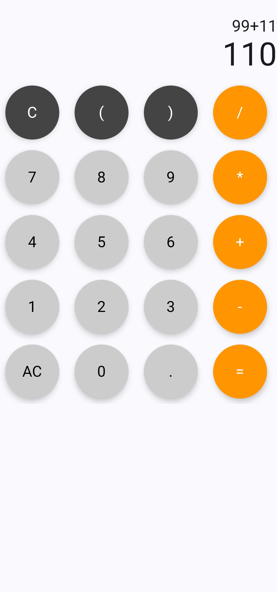

# Android Calculator App

A simple and elegant calculator application built with Jetpack Compose for Android.

<table align="center">
  <tr>
    <td align="center"><b>Dark Mode</b></td>
    <td align="center"><b>Light Mode</b></td>
  </tr>
  <tr>
    <td></td>
    <td></td>
  </tr>
</table>

## Features

- Clean, modern UI built with Jetpack Compose
- Basic arithmetic operations (addition, subtraction, multiplication, division)
- Parentheses support for complex expressions
- Real-time calculation as you type
- Clear and AC (All Clear) functionality

## Technologies Used

- Kotlin
- Jetpack Compose for UI
- MVVM Architecture
- LiveData for reactive UI updates
- Mozilla Rhino for JavaScript expression evaluation

## Project Structure

```
app/
├── src/
│   ├── main/
│   │   ├── java/com/example/calc/
│   │   │   ├── Calculator.kt           # Main calculator UI components
│   │   │   ├── CalculatorViewModel.kt  # ViewModel for calculator logic
│   │   │   ├── MainActivity.kt         # Entry point for the application
│   │   │   └── ui/theme/               # UI theme definitions
│   │   ├── res/                        # Android resources
│   │   └── AndroidManifest.xml         # App configuration
│   ├── androidTest/                    # Instrumented tests
│   └── test/                           # Unit tests
└── build.gradle.kts                    # Project build configuration
```

## Setup Instructions

### Prerequisites

- Android Studio Arctic Fox (2023.3.1) or higher
- JDK 11 or higher
- Android SDK 26+ (Android 8.0 Oreo)

### Installation

1. Clone the repository:
   ```
   git clone https://github.com/yourusername/calc.git
   ```

2. Open the project in Android Studio.

3. Sync the project with Gradle files.

4. Run the app on an emulator or physical device.

## How It Works

The app follows the MVVM (Model-View-ViewModel) architecture:

- **View Layer**: Implemented with Jetpack Compose. The `Calculator.kt` file contains the UI components that display the calculator interface and handle user interactions.

- **ViewModel Layer**: The `CalculatorViewModel.kt` handles the business logic of the calculator. It processes button clicks, manages the equation state, and calculates results using the Mozilla Rhino JavaScript engine.

- **Data Flow**: 
  - User input from button presses is passed to the ViewModel
  - The ViewModel updates LiveData objects
  - The UI observes these LiveData objects and updates accordingly

## Acknowledgments

- [Jetpack Compose Documentation](https://developer.android.com/jetpack/compose)
- [Mozilla Rhino](https://github.com/mozilla/rhino) for JavaScript expression evaluation
